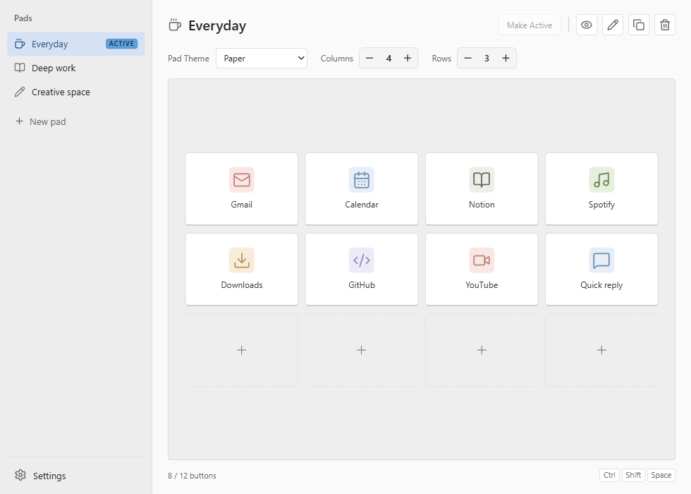
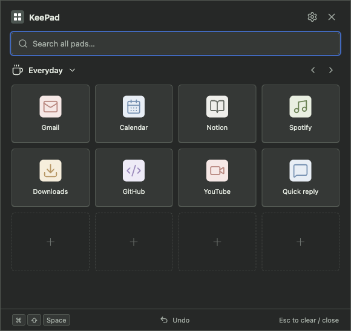
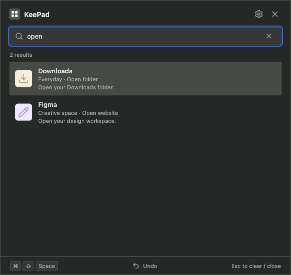
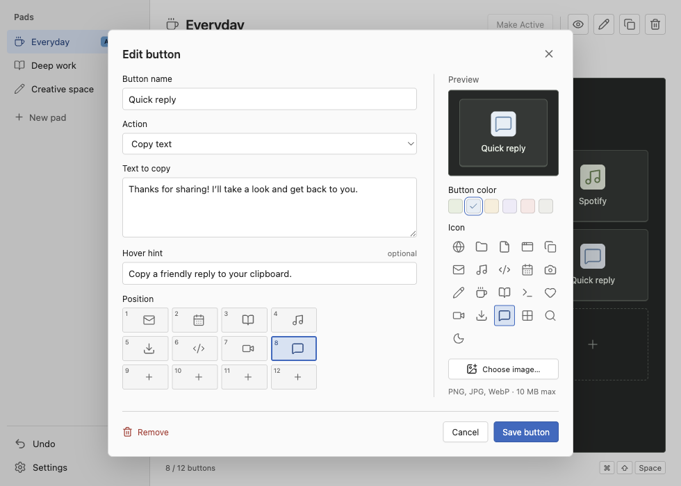
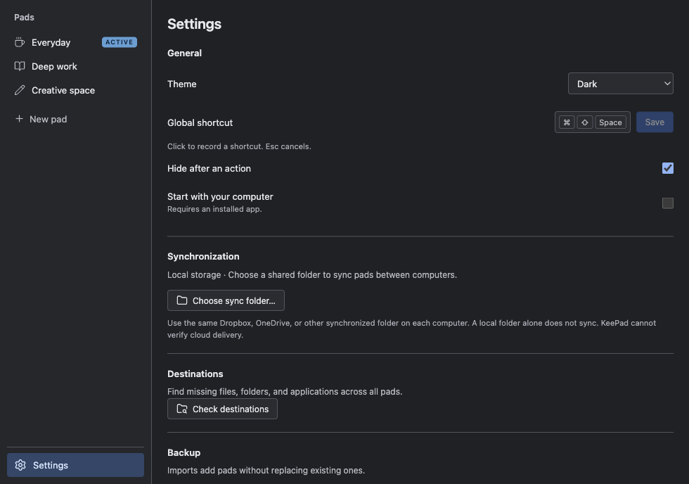
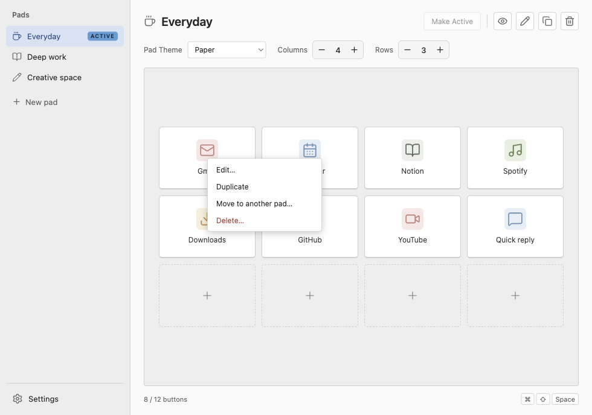
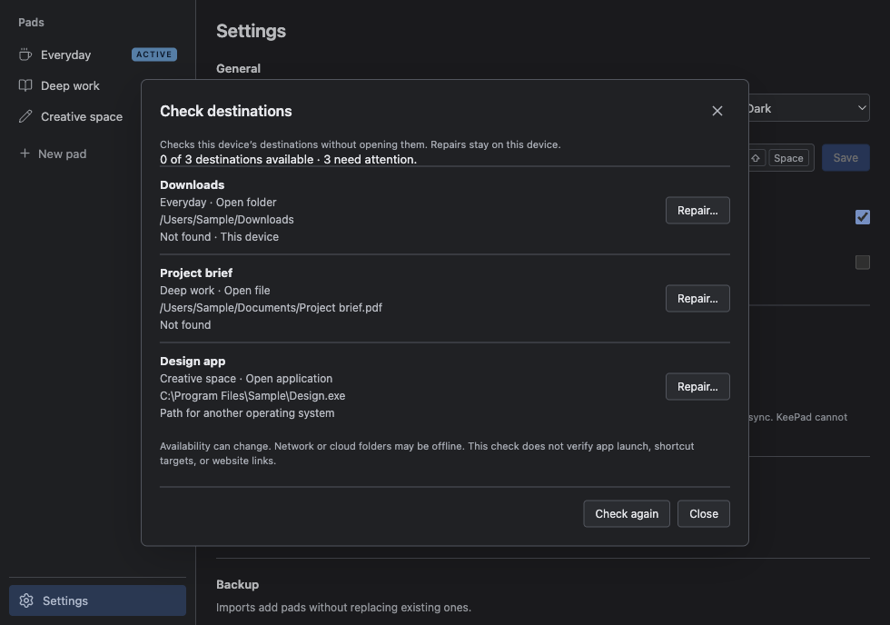
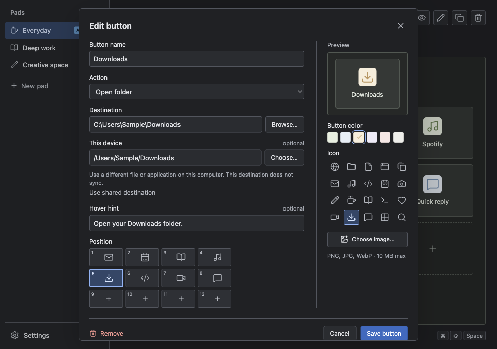

# ⌨️ KeePad

**Your own on-screen shortcut pad for Mac and Windows.**

KeePad gives your everyday actions a button: open a website, file, folder, or app, or copy a text snippet. It waits in your Mac's menu bar or Windows notification area until you need it.

> 🚧 **Development version:** native checks have passed on macOS Apple Silicon. Windows support is implemented, but its validation is tracked separately. Signed, ready-to-install releases are not available yet. See [development status](docs/progress.md).

## 👀 A look inside

Create pads, change their size, and choose which one opens by default.



Open your compact pad from the menu bar, notification area, or keyboard shortcut.



<details>
<summary>Find a button across all pads</summary>



</details>

<details>
<summary>See the button editor</summary>



</details>

<details>
<summary>KeePad in Dark mode</summary>



</details>

<details>
<summary>Right-click a button</summary>



</details>

Screenshots use sample data from the actual app. [How they are made](docs/screenshots/README.md).

## ✨ What you can do

- **Find any button quickly:** summon KeePad and type. Search covers button names and descriptions across every pad, with name matches first.
- **Make several pads** for work, projects, or personal shortcuts.
- **Give each button an action:** website, file, folder, app, or text to copy.
- **Choose icons or your own images**, button colors, and six pad themes.
- **Choose Light, Dark, or System** in Settings → Theme. Each pad keeps its own **Pad Theme**, and its pad icon can be **None**.
- **Adjust Columns and Rows** with simple −/+ controls. KeePad prevents shrinking a pad if it would hide saved buttons.
- **Arrange buttons visually:** drag them around the editor, or choose a spot on the mini pad in the button dialog. Dropping onto another button swaps their positions.
- **Right-click a button** to edit, duplicate, move it to another pad, or delete it. This works in the editor and the compact pad.
- **Drop a file onto the editor grid** to make an open-file button. Folders and applications work too. Drop one item at a time; replacing an existing action asks for confirmation.
- **Preview before activating.** The eye button shows a pad without changing your active choice.
- **Find broken destinations:** Settings → Destinations → Check destinations checks file, folder, and app buttons across all pads. Repair chooses a replacement for this device without changing shared paths.
- **Keep your setup locally**, with backup export and import.
- **Optionally sync pads between Mac and Windows** through a Dropbox, OneDrive, or other synchronized folder. Preferences stay on each device; competing pad edits are preserved for review. [Setup and limits](docs/synchronization.md).

## 🧭 Using KeePad

1. Click **New pad**, give it a name, and create it.
2. Click an empty **+** button. Choose an action, enter its destination, then save.
3. Adjust **Pad Theme**, **Columns**, and **Rows** as needed.
4. Click **Make Active**, or double-click the pad's name in the sidebar. Its **ACTIVE** badge tells you it is selected for everyday use.
5. Open the pad whenever you need it:

| Computer | Default shortcut | Mouse option |
| --- | --- | --- |
| Mac | **Command + Shift + Space** | Click KeePad in the menu bar |
| Windows | **Ctrl + Shift + Space** | Click KeePad in the notification area beside the clock |

The pad opens in the center of the screen containing your pointer. Click a button to run its action, or type into the automatically focused search box. Use **↑/↓** and **Enter** to run a result; each result shows its pad. Searching and running a result leave your active pad unchanged. **Esc** clears a search first, then hides the pad. Closing a window keeps KeePad running; to exit, right-click its menu-bar/notification icon and choose **Quit KeePad**.

Search ignores case and accents and matches all the words you type in button names or descriptions (the **Hover hint** field). It does not inspect files, paths, URLs, or copied text. Each summon clears the previous search.

To bind a file quickly, drag it from Finder or File Explorer onto an empty **+** position in the editor. Dropping onto an existing button replaces only its action after confirmation; its name and image stay the same. Files stay in their original location.

Single-clicking a pad selects it for editing. The **eye**, **pencil**, **copy**, and **trash** toolbar buttons preview, edit, duplicate, and delete it. Hover over an icon for help. Settings lets you choose Light/Dark/System appearance, change the shortcut, choose whether the pad hides after an action, and manage backups.

## 🔧 Repair a missing file or app

Open **Settings → Destinations → Check destinations**. KeePad lists paths that need attention and identifies missing items, access problems, and paths from another operating system. Click **Repair…** and select the replacement. Cancel leaves the button unchanged.

Repairs use **This device** destinations, so they do not alter your other computers. Checks never open files or run buttons. Network/cloud items may be temporarily unavailable; reconnect them and use **Check again**. An available path does not guarantee an app will launch or that a Windows shortcut's target exists.

<details>
<summary>See the destination checker</summary>



</details>

## 🔄 Share pads between computers

Open **Settings → Synchronization → Choose sync folder…**. On your first computer, choose a dedicated folder inside Dropbox, OneDrive, or another sync provider and create a shared library. After that folder downloads on the second computer, choose it there and use the shared library. KeePad backs up the previous local library before switching.

Both installations use the same library format. Keep the folder available offline. A regular local folder does not sync by itself; your provider transports changes. KeePad keeps local copies and retries queued changes when the folder returns.

For files/apps in different locations, edit the button and set **This device** to the destination on that computer. This does not change the destination on your other devices. Sync shares button definitions and images, not the files or applications they open. [Conflict handling, recovery, and current limits](docs/synchronization.md).

<details>
<summary>Use different destinations on Mac and Windows</summary>



</details>

## 🚀 Try the development build

There is no one-click installer release yet. If you are comfortable running a few terminal commands:

1. Install **Node.js 24**, which includes npm, and Git.
2. Open Terminal (Mac) or PowerShell (Windows).
3. Run these commands, one at a time. Your GitHub account needs access to this private repository:

```sh
git clone https://github.com/mtom2k/keepad.git
cd keepad
npm ci
npm run dev
```

The first two commands download KeePad and enter its folder. `npm ci` downloads the project's dependencies. `npm run dev` starts KeePad and opens its editor on first use. Keep the terminal open while using this development mode.

To create an application bundle or installer locally, see [packaging instructions](docs/releasing.md). Developers can find all commands in the [generated reference](docs/reference.md).

## 🔒 Your data and permissions

Pads, images, and snippets are stored on your computer. If you enable synchronization, their shared library and version history also live in your chosen folder and may be uploaded by its provider. Backups include your images, file paths, and copied text, so keep them somewhere private. Imported/shared file paths may need a **This device** destination on another computer.

macOS may ask before opening a protected folder. KeePad does not require Accessibility, screen-recording, or Full Disk Access for its current actions. Launch at login is available after installing the packaged app.

Need help? Read [troubleshooting](docs/troubleshooting.md).

## 🛠️ For developers and coding agents

Start with [the knowledge base](docs/README.md) and [contributor instructions](AGENTS.md).

| Looking for… | Read |
| --- | --- |
| Setup and contribution workflow | [CONTRIBUTING.md](CONTRIBUTING.md) |
| Current progress and next work | [Development progress](docs/progress.md) |
| How the app is built | [Architecture](docs/architecture.md) |
| Why decisions were made | [Architecture decision records](docs/adr/README.md) |
| Data formats and safeguards | [Data model](docs/data-model.md) |
| Tests and screenshots | [Testing](docs/testing.md) |
| Keeping documentation current | [Documentation maintenance](docs/maintenance.md) |
| Taking over or handing off work | [Developer and AI handoff](docs/handoff.md) |

**Documentation is part of the feature:** work is complete when implementation, current guides, validation evidence, and handoff agree. Documentation changes belong in the same commit as the code they describe. Local checks verify relative file links, generated reference freshness, and documentation impact; contributors still review the content for accuracy. GitHub hosts the private source repository; no CI/CD is configured.
