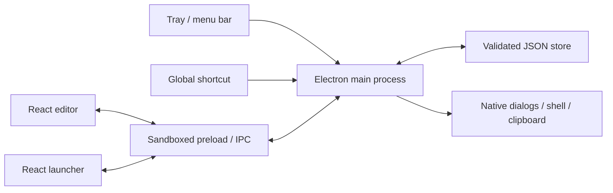

# Architecture

Status: current implementation. See [ADRs](adr/README.md) for why these choices were made and [progress](progress.md) for validation status.

## Runtime structure

KeePad is an Electron desktop app with a React renderer. There is no server or account system. Two local windows share one main process and one persisted state store.

| Area | Source | Responsibility |
| --- | --- | --- |
| Main process | [electron/main.ts](../electron/main.ts) | Lifecycle, tray menus, windows, shortcuts, native actions, serialized mutations |
| Bridge | [electron/preload.cts](../electron/preload.cts) | Explicit API methods and event subscriptions; compiled to CommonJS for sandbox compatibility |
| Store | [electron/store.ts](../electron/store.ts) | Validation, temporary-file replacement, corruption recovery |
| Shared contract | [shared/model.ts](../shared/model.ts) | Zod schemas, types, starter state, import merge |
| Renderer | [src/main.tsx](../src/main.tsx) | Editor, launcher, dialogs, settings, local edit selection |
| UI primitives | [src/components.tsx](../src/components.tsx) | Icons, tooltips, modal dialogs, macro keys, number steppers |
| Button placement | [src/pad-layout.ts](../src/pad-layout.ts) | Shared immutable move/swap operation for drag-and-drop, dialog saves, and position preview |
| Native / preview adapter | [src/api.ts](../src/api.ts) | Electron bridge or explicitly limited browser preview |
| Styling | [src/styles.css](../src/styles.css) | Traditional utility layout and per-pad themes |

Vite builds the renderer into `dist/`. TypeScript emits main/preload/shared modules into `dist-electron/`. electron-builder includes both plus assets in `app.asar`. The app identity is defined in `package.json`, not inferred from an installed app's display name.

## Window lifecycle

- The editor uses a native frame; the launcher is a compact frameless, always-on-top window.
- Both skip the taskbar. macOS uses the accessory activation policy and `LSUIElement` in the bundle.
- First run, storage recovery warnings, shortcut-registration failure, or `--editor` opens the editor.
- Close hides a window. The application stays alive with no visible windows. Quit releases the global shortcut and tray.
- Tray left-click toggles the launcher. The right-click menu offers opening, pad selection, management, Settings, version, and Quit.
- Tray, menu, app activation, and shortcut entry points use the same centering function. It centers within the work area of the display nearest the pointer, with bounds constrained to available space.
- The hide-after-action setting also controls launcher hiding on blur. The test profile suppresses blur-hiding so automation can inspect it; this is a coverage limitation.

## Selected, active, and preview pad

These are three different concepts; see [ADR 0004](adr/0004-pad-selection-and-launcher-behavior.md).

- **Selected:** renderer-local `selectedPadId`; controls the editor. Falls back to the active pad if absent/deleted. It is not stored across application restarts.
- **Active:** persisted `State.activePadId`; used by tray/shortcut invocation. Make Active, sidebar double-click, tray radio selection, and launcher pad cycling can change it.
- **Preview:** main-process `previewPadId`, exposed as `Snapshot.launcherPadId`; allows the eye button to display a selected inactive pad without activating it. Normal summon clears it. Active-pad changes or deletion of the previewed pad clear it.

The launcher resets focus to its non-tab-stop root on initial load and `launcher:shown`. Native show/focus events trigger that notification. It does not remove keyboard focus styling from actual controls: Tab still provides a visible focus indicator.

## Saving and executing

Renderer edits submit complete state through `state:save`. Main-process mutations are serialized. The main process validates the payload, rejects stale revisions, applies shortcut/startup changes with rollback where possible, writes the next revision, and broadcasts a fresh snapshot. The renderer refreshes after a rejected stale save; it does not automatically merge conflicting drafts.

Action requests contain pad/button IDs. Main resolves the stored action; renderers do not supply arbitrary shell instructions. Website actions call the OS browser handler; file/folder/app actions use native path opening; text actions await clipboard writes. Native failures return a typed error for UI display.

Imports are validated and merged inside the serialized mutation queue. Exports write a snapshot to a user-selected location. See [data model](data-model.md).

Editor drag-and-drop uses native HTML drag events and an in-memory source identity/revision; arbitrary external drag payloads cannot move keys. A changed pad/revision or an in-flight save rejects the drop. A valid drop saves through the existing state API, and tooltips are suppressed while dragging. The mini pad previews the same placement operation as Save; keyboard navigation provides a non-drag alternative. Neither path changes the persisted schema or invokes actions.

## Application appearance

Application appearance is stored in `settings.theme` separately from `Pad.theme`. Main applies Electron `nativeTheme.themeSource` after persistence and at startup. The renderer resolves System with a live `prefers-color-scheme` listener and sets an attribute on the document root so portaled dialogs/tooltips share editor appearance. CSS tokens handle application surfaces; existing pad color variables remain independent. See [ADR 0007](adr/0007-application-appearance-and-optional-pad-icons.md).

## IPC and security boundary

Requests return `Result<T>` (`ok/value` or `ok/error`). The API contract lists allowed operations; preload exposes no generic `send`, Node.js API, or arbitrary channel invocation. Subscriptions return cleanup functions.

The main process checks known web contents, the main frame, and the exact local file/dev origin for each request. Both windows have sandboxing, context isolation, and no Node integration. Navigation and new windows are blocked. The HTML CSP limits scripts to local assets and images to local/data sources. The development server is accepted only at the explicitly configured loopback URL and is ignored in packaged builds.

Only HTTP(S) website actions and supported inline raster images are accepted. Native dialogs are the path/image input mechanism. This does not make all user-selected files safe: opening a chosen application intentionally executes it via the OS. No command runner, keyboard injection, analytics, or cloud storage is implemented.
