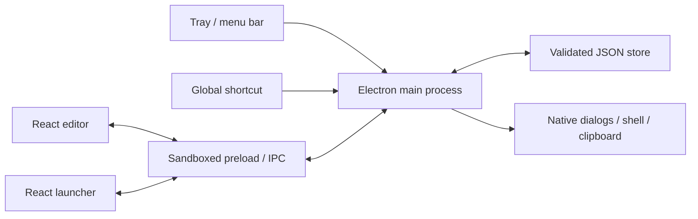

# Architecture

Status: current implementation. See [ADRs](adr/README.md) for why these choices were made and [progress](progress.md) for validation status.

## Runtime structure

KeePad is an Electron desktop app with a React renderer. There is no server or account system. Two local windows share one main process and one persisted state store.

| Area | Source | Responsibility |
| --- | --- | --- |
| Main process | [electron/main.ts](../electron/main.ts) | Lifecycle, tray menus, windows, shortcuts, native actions, serialized mutations |
| Bridge | [electron/preload.cts](../electron/preload.cts) | Explicit API methods and event subscriptions; compiled to CommonJS for sandbox compatibility |
| Folder synchronization | [electron/sync.ts](../electron/sync.ts), [shared/sync.ts](../shared/sync.ts) | Immutable pad history, validation, local outbox, conflicts, and device paths |
| Sync settings | [src/sync-settings.tsx](../src/sync-settings.tsx) | Opt-in folder confirmation, status, version review/resolution, disconnect |
| Store | [electron/store.ts](../electron/store.ts) | Validation, temporary-file replacement, corruption recovery |
| Shared contract | [shared/model.ts](../shared/model.ts) | Zod schemas, types, starter state, import merge |
| Renderer | [src/main.tsx](../src/main.tsx) | Editor, launcher, dialogs, settings, local edit selection |
| UI primitives | [src/components.tsx](../src/components.tsx) | Optional pad glyphs, tooltips, modal dialogs, macro keys, number steppers, visual position picker, keyboard-accessible button menu |
| Launcher search | [src/launcher-search.tsx](../src/launcher-search.tsx), [src/search.ts](../src/search.ts) | Transient query/focus, accessible result navigation, pure cross-pad ranking |
| Button placement | [src/pad-layout.ts](../src/pad-layout.ts) | Shared immutable move/swap operation for drag-and-drop, dialog saves, and position preview |
| Button duplication/moves | [src/button-actions.ts](../src/button-actions.ts) | Immutable first-free-slot copy/move; full-pad rejection and ID collision handling |
| Dropped destinations | [electron/file-binding.ts](../electron/file-binding.ts) | Validate native absolute path and inspect file metadata to describe a binding |
| Native / preview adapter | [src/api.ts](../src/api.ts) | Electron bridge or explicitly limited browser preview |
| Styling | [src/styles.css](../src/styles.css) | Traditional utility layout and per-pad themes |

Vite builds the renderer into `dist/`. TypeScript emits main/preload/shared modules into `dist-electron/`. electron-builder includes both plus assets in `app.asar`. The app identity is defined in `package.json`, not inferred from an installed app's display name.

## Window lifecycle

- The editor uses a native frame; the launcher is a compact frameless, always-on-top window.
- Both skip the taskbar. macOS uses the accessory activation policy and `LSUIElement` in the bundle.
- First run, storage recovery warnings, shortcut-registration failure, or `--editor` opens the editor.
- Close hides a window. The application stays alive with no visible windows. Quit releases the global shortcut and tray.
- A second process for the same profile yields to the single-instance lock and asks the existing process to show its active launcher; `--editor` is only consulted during normal startup.
- Tray left-click toggles the launcher. The right-click menu offers opening, pad selection, management, Settings, version, and Quit.
- Tray, menu, app activation, and shortcut entry points use the same centering function. It centers within the work area of the display nearest the pointer, with bounds constrained to available space.
- The hide-after-action setting also controls launcher hiding on blur. The test profile suppresses blur-hiding so automation can inspect it; this is a coverage limitation.

## Selected, active, and preview pad

These are three different concepts; see [ADR 0004](adr/0004-pad-selection-and-launcher-behavior.md).

- **Selected:** renderer-local `selectedPadId`; controls the editor. Falls back to the active pad if absent/deleted. It is not stored across application restarts.
- **Active:** persisted `State.activePadId`; used by tray/shortcut invocation. Make Active, sidebar double-click, tray radio selection, and launcher pad cycling can change it.
- **Preview:** main-process `previewPadId`, exposed as `Snapshot.launcherPadId`; allows the eye button to display a selected inactive pad without activating it. Normal summon clears it. Active-pad changes or deletion of the previewed pad clear it.

The launcher clears and focuses its search field on initial load and `launcher:shown`. The shared `showLauncher` path sends that event after showing/focusing, including already-visible previews; ordinary native refocus does not reset an unfinished query. Pending launcher confirmation/menu/picker state is discarded on summon. Visible Tab focus is preserved. [ADR 0009](adr/0009-global-launcher-search.md) supersedes the root-focus portion of ADR 0004.

## Saving and executing

Renderer edits submit complete state through `state:save`. Main-process mutations are serialized. The main process validates the payload, rejects stale revisions, applies shortcut/startup changes with rollback where possible, writes the next revision, and broadcasts a fresh snapshot. The renderer refreshes after a rejected stale save; it does not automatically merge conflicting drafts.

Action requests contain pad/button IDs. Main resolves the stored action; renderers do not supply arbitrary shell instructions. Website actions call the OS browser handler; file/folder/app actions use native path opening; text actions await clipboard writes. Native failures return a typed error for UI display.

Imports are validated and merged inside the serialized mutation queue. Exports write a snapshot to a user-selected location. See [data model](data-model.md).

Editor drag-and-drop uses native HTML drag events and an in-memory source identity/revision; arbitrary external drag payloads cannot move keys. A changed pad/revision or an in-flight save rejects the drop. A valid drop saves through the existing state API, and tooltips are suppressed while dragging. The mini pad previews the same placement operation as Save; keyboard navigation provides a non-drag alternative. Neither path changes the persisted schema or invokes actions.

Right-click menus are renderer portals in either window. Duplicate/move/delete use the same revision-checked save path; menu dialogs retain the initiating revision. Edit from the launcher uses `window:edit-button`: main validates stored pad/button IDs before routing the editor through an encoded local hash. Escape handling lives in the renderer so a menu/dialog dismisses before the launcher hides.

External file drops are separate from internal rearrangement. The editor passes the actual `File` object to preload, which resolves its native path with Electron `webUtils.getPathForFile`. `file:describe` validates the trusted sender and the host-native absolute path, then stats the destination without reading contents or opening it. It returns a name, type, generic icon, and path. The renderer creates a button or asks before replacing an occupied action, then saves through ordinary revision validation. State changes while metadata is being resolved or replacement is pending reject the draft. Global drop prevention blocks browser navigation; only editor cells bind files. See [ADR 0008](adr/0008-button-menus-and-native-file-drops.md).

## Search execution and scope

`searchButtons` scans the current snapshot's bounded set of saved buttons (at most 600), matching normalized label/description terms and ranking name matches first. No index, dependency, IPC method, schema change, file read, or network request is added. The renderer uses the stored source pad/button IDs for `action:run` and context-menu operations; main still resolves/validates the current stored action. Search never writes activation or editor selection. Results update from snapshots, and an empty query renders the usual active/preview grid.

The input uses combobox/listbox semantics with an active descendant. Arrow keys change selection; composition and repeated Enter events do not run actions. Escape capture clears the query only when no modal/menu is open, allowing those components to dismiss first. Search results scroll independently beneath a fixed search field. The centered window allows an additional search row and remains constrained to the display work area.

## Optional synchronization

The local store remains authoritative for the current cache and device preferences. A validated optional `device` envelope commits the cache and pending outgoing records together; renderer saves cannot replace this metadata. Main initializes `SyncEngine`, polls every five seconds, and requests a check after local saves. Checks and all local mutations share the existing serialization queue. Applying incoming pads increments the local revision so stale renderer writes fail. Pad/button dialogs additionally retain their opening revision, and deleting a pad closes its open editor draft.

The folder contains immutable whole-pad or deletion records linked by causal parent hashes. The engine validates format, hashes, parent availability, and resource limits before materializing records. Files arriving out of order or malformed never reset local pads. Multiple heads per pad are preserved and exposed as conflicts; independent pads combine. The shared format, ordering, and file naming are platform-neutral. Settings, active selection, and device overrides stay local. Full protocol/recovery rationale: [ADR 0010](adr/0010-optional-folder-synchronization.md); user setup/limits: [synchronization](synchronization.md).

New IPC methods are narrow: native folder selection returns a confirmation token, connection reinspects the chosen folder, refresh runs the engine, preview returns a stored conflict version without execution, resolve validates reviewed head IDs, and disconnect retains a backed-up local copy. `state:save` optionally carries one validated device-destination update, stored atomically with the state. Action execution resolves that device override only while its original shared type/target still match, validates host-native syntax, then follows the existing path opener. Invalid foreign paths explain how to set a local destination.

## Application appearance

Application appearance is stored in `settings.theme` separately from `Pad.theme`. Main applies Electron `nativeTheme.themeSource` after persistence and at startup. The renderer resolves System with a live `prefers-color-scheme` listener and sets an attribute on the document root so portaled dialogs/tooltips share editor appearance. CSS tokens handle application surfaces; existing pad color variables remain independent. See [ADR 0007](adr/0007-application-appearance-and-optional-pad-icons.md).

## IPC and security boundary

Requests return `Result<T>` (`ok/value` or `ok/error`). The API contract lists allowed operations; preload exposes no generic `send`, Node.js API, or arbitrary channel invocation. Subscriptions return cleanup functions.

The main process checks known web contents, the main frame, and the exact local file/dev origin for each request. Both windows have sandboxing, context isolation, and no Node integration. Navigation and new windows are blocked. The HTML CSP limits scripts to local assets and images to local/data sources. The development server is accepted only at the explicitly configured loopback URL and is ignored in packaged builds.

Only HTTP(S) website actions and supported inline raster images are accepted. File/folder/app destinations can be typed, chosen with Browse, or bound by dropping a local item in the editor; schema validation requires absolute paths and execution checks access/existence. Button images are selected through the native image dialog. This does not make all user-selected files safe: opening a chosen application intentionally executes it via the OS. No command runner, keyboard injection, analytics, or direct cloud-provider API is implemented. Optional shared-folder data may be transported by the user’s sync provider.

The browser adapter stores a separate preview state in localStorage and can copy text, but cannot bind dropped native files or validate native lifecycle or OS actions. Its displayed version is currently a literal in `src/api.ts`; keep it aligned with package version during release preparation.
